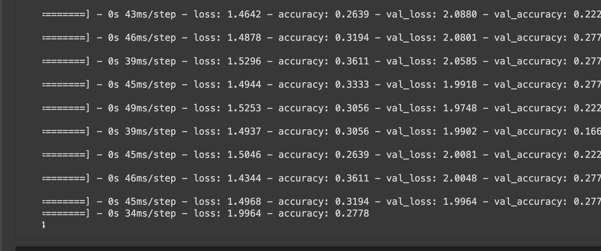

# Epic fail: Microtonal chords analysis
  

## Inspiration

Microtonal music is extremely hard to grasp for someone like me as my sense of pitch is really bad at the sub-semitone level. In other words, I fail to figure out the difference between 2 notes which are less than 15 cents apart. However, I still can sense if notes are locked-in (a.k.a in perfect ratios of each other) by simply hearing it and this is common for many other humans just like me. Now, I want to know if a computer can identify what it is to tell apart if something is in a different tuning or not and the best way to check that is by seeing if it can tell one tuning apart from another. 
  

## EDO and it's definition

Placeholder for EDO definition: An EDO, or Equal Division of the Octave, is a tuning system that divides the octave into a specific number of equally spaced steps. Traditional Western music uses 12-EDO, but microtonal music explores other divisions such as 19-EDO, 31-EDO, and beyond. These alternative tunings offer unique intervals and harmonies not found in standard tuning.
Refer the [Xenharmonic Wiki](https://en.xen.wiki/w/EDO).
  

## Approach

If you'd like to see the full history of how my code developed into this, do refer [Github](https://github.com/RP335/microtonal_experiments)

To summarize, I started by reading up about methods to classify stuff and came across a big explanation of neural networks and went down the rabbit hole of exploring these things.
  
  

I looked at [this](https://arxiv.org/abs/2405.16000) for reference to gain some insights as to how I could analyse pitched audio. 
I was dealing with polyphonic audio and felt like I was shooting in the dark after getting this on an accuracy score upon implementing what was in that paper.

  
Scratching my head, I thought it was something wrong with how I processed the audio and looked at means how to improve that. I was redirected to sources which explained more things about better feature extraction, hyperparameter tuning, etc.
  

Which led me to gain further insights into a topic I'd brushed upon in 3rd year (I'd done one experiment using CNNs to classify different drum samples back then inspired from Dylan Tallchief's [video](https://youtu.be/wx_iuO-dI5w?feature=shared))

  

But for now, here's some real technical analysis of the same.

## Technical Insights

- Convolutional Neural Networks (CNNs): Leveraging the power of CNNs to capture the spatial hierarchies in audio data.
- Time-Distributed Networks (TDNs) with LSTMs: Combining TDNs with Long Short-Term Memory (LSTM) networks to handle the temporal     aspects of audio signals.
- Simple Classifiers: Exploring basic classifiers like RandomForest and SVM to benchmark performance.
- Hyperparameter Tuning: Fine-tuning model parameters to improve accuracy.

## Conclusion
Given my exploration of this topic, I think that CNNs with TDNs gave the best accuracy (27% in this case). Which is really bad for a NN. But hey, I would get a 0 so it's better than me ofc. Cause after 200 epochs, you'd expect a random chance out of 6 edos which would be like 16.67% but this is 27 which is better. Maybe, there's a way out? I don't know yet. I'd have to look at this in detail later, but I'm going to sleep now. 

